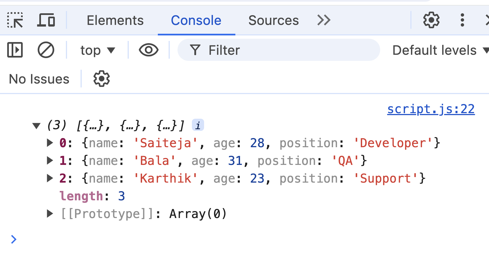

# Javascript Nuggets - Map


👉 [Watch on Youtube](https://youtu.be/80KX6aD9R7M?si=GG5s4eRZxwXnnyDb)

---

- what makes map so special is the fact that as we're iterating over the original array, essentially we can return whatever we would want.
- map returns a new array even if it's just an empty array then it does not change the size of the original array unlike the filter method and it always uses the values from the original array when making a new one


```js
// I want to iterate over people array and just grab the age
const people = [
    {
        name:'Saiteja',
        age: 28,
        position: 'Developer'
    }, 
    {
        name:'Bala',
        age: 31,
        position: 'QA'
    }, 
    {
        name:'Karthik',
        age: 23,
        position: 'Support'
    }
]
```
----

### Syntax:

```js
// with regular function 
// our array has 3 objects and that is the reason for 3 undefined
const ages = people.map(function(){})
console.log(ages) // [undefined, undefined, undefined]
```

```js
// with arrow function
const ages = people.map(()=>{})
console.log(ages) // [undefined, undefined, undefined]
```

---

### Deep Dive:

#### i) Importance of return keyword in map
```js
// we can define any param in the callback function while iterating over original array (ex: orange, person, department, item)

const ages = people.map((person)=>{
    console.log(person);
    return 'hello world'
})
console.log(ages) // [hello world, hello world, hello world]
```

```js
// return the item defined in callback function
const ages = people.map((person) => {
  return person;
});
console.log(ages); // this will print the same array of objects defined in the original array
```

```js
// with arrow function
// you don't need to use return keyword and still achieve the same
const ages = people.map((person) =>  person);
console.log(ages); // this will print the same array of objects defined in the original array
```
### Example output for above: 


----

#### ii) Replacing Callback function with a function

```js
const getAges = (person)=> person.age
```

```js
const ages = people.map(getAges);
console.log(ages); // [28, 31 , 23]
```

-----

### iii) Return an object

```js
const newPeople = people.map((item) => {
  return {
    firstName: item.name,
    age: item.age,
  };
});
console.log(newPeople); 

//[{firstName: 'Saiteja', age: 28}, {firstName: 'Bala', age: 31}, {firstName: 'Karthik', age: 23}]
```