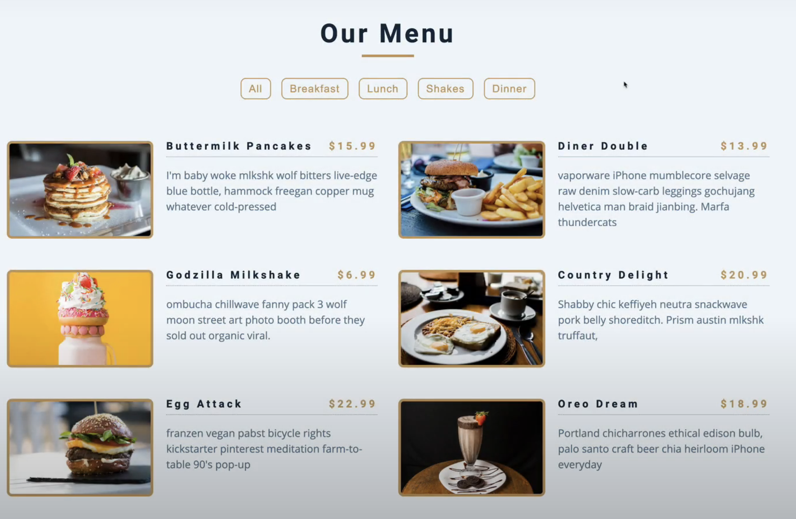

# Get Unique Values from an array using ES6

👉 [Watch on Youtube](https://youtu.be/yxT1lgupUrY?si=N1u8RhfGuyZTU94)

```js
- We are using Set to get unique values
```

```js
const menu = [
  {
    name: 'pancakes',
    category: 'breakfast',
  },
  {
    name: 'burger',
    category: 'lunch',
  },
  {
    name: 'steak',
    category: 'dinner',
  },
  {
    name: 'bacon',
    category: 'breakfast',
  },
  {
    name: 'eggs',
    category: 'breakfast',
  },
  {
    name: 'pasta',
    category: 'dinner',
  },
];

```


```js
// Log unique values from array of objects
const categories = [
  'all',
  ...new Set(menu.map((menuItem) => menuItem.category)),
];

console.log(categories) // [ 'all', 'breakfast', 'lunch', 'dinner' ]
```

## You can use these categories as buttons

