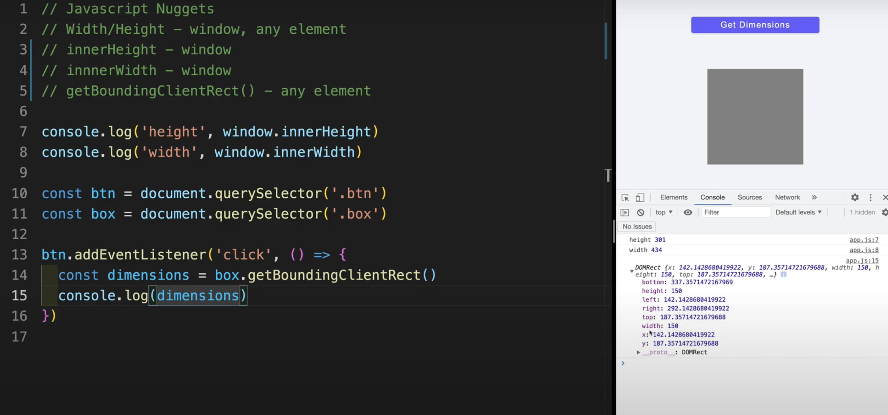

# Javascript Nuggets - Width/Height

[YouTube Video](https://www.youtube.com/watch?v=v8YENdbDv1w)

- **Topic**: Properties to access the width and height of the window, and a function to get dimensions for any element.

**Window Height and Width**

- Properties are located on the `window` object.
- Example:
  ```javascript
  console.log(window.innerHeight);
  console.log(window.innerWidth);
  ```
  - `window.innerHeight`: Gives the height of the window.
  - `window.innerWidth`: Gives the width of the window.
- Works in both **vanilla.js** and **React.js**.

**Behavior of Height and Width**

- Changing the size of the developer tools or screen affects these properties.
  - Smaller dev tools = smaller height.
  - Bigger screen = larger width.
- Example in action when resizing the screen:
  ```javascript
  console.log(window.innerHeight);
  console.log(window.innerWidth);
  ```

**Method: `getBoundingClientRect`**

- **Purpose**: Get the dimensions of any element.
- Example HTML structure:
  ```html
  <button class="btn">Click Me</button>
  <div class="box"></div>
  ```

**Using `getBoundingClientRect`**

- JavaScript code to log dimensions of the box when the button is clicked:
  ```javascript
  const btn = document.querySelector('.btn');
  const box = document.querySelector('.box');

  btn.addEventListener('click', () => {
    const dimensions = box.getBoundingClientRect();
    console.log(dimensions);
  });
  ```


-----

- Output on click:
  - **Properties logged**:
    - `top`: Distance from top of the screen to the top of the element.
    - `bottom`: Distance from top of the screen to the bottom of the element.
    - `height`: Element height (e.g., 150px).
    - `width`: Element width (e.g., 150px).
    - `left`: Distance from left edge of the screen to the left edge of the element.
    - `right`: Distance from left edge of the screen to the right edge of the element.
    - `x`: Same as `left`.
    - `y`: Same as `top`.

**Detecting Off-Screen Elements**

- Modifying CSS to move elements off-screen:
  ```css
  .box {
    margin-left: -4rem;
  }
  ```
- Example behavior:
  - If `left` and `x` values are negative, the element is off the screen.
- **Use case**:
  - Detect off-screen elements to apply functionality, such as hiding or showing them.
  - Example:
    ```javascript
    if (dimensions.left < 0) {
      console.log("Element is off-screen");
    }
    ```

**Applications in Vanilla.js and React.js**

- Use these properties for:
  - Scroll events.
  - Dynamic element visibility.
- **React-specific example**:
  - Frequently used in React projects to handle complex problems.
  - Example: Controlling UI based on element visibility.

---